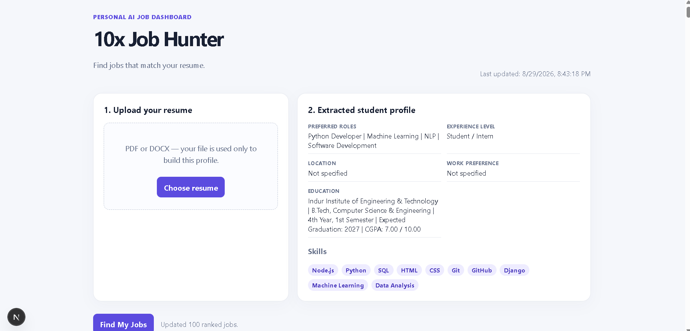
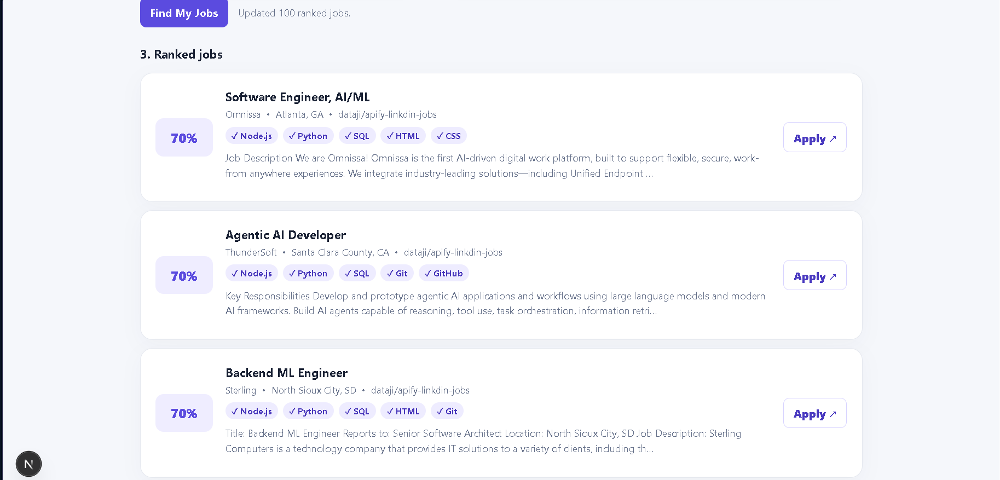
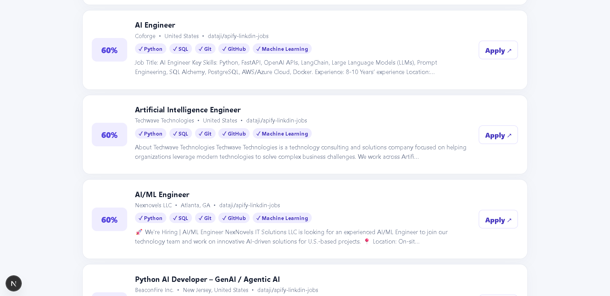
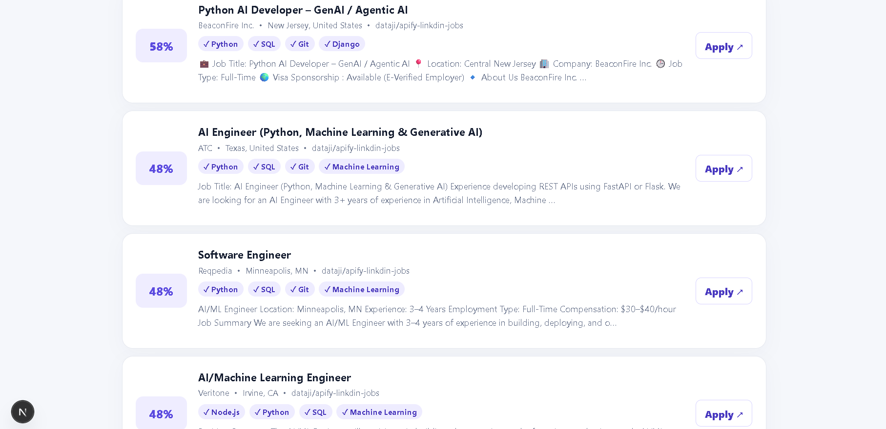

# 🤖 AI Job Search Engine

> **An AI-powered job discovery and matching platform that analyzes a student's resume, finds relevant job opportunities, and ranks them based on skills, roles, experience, and preferences.**

The **AI Job Search Engine** is a full-stack web application designed to make the job search process more focused and efficient.

Instead of manually browsing through large numbers of job listings, users can upload their **PDF or DOCX resume**, allowing the application to extract a structured candidate profile and use it to discover and rank relevant job opportunities.

The project combines **resume parsing, AI-assisted profile extraction, job data collection, matching algorithms, and a responsive dashboard** into a single workflow.

> **Note:** This project is intended as a learning and portfolio project. It does not automatically apply for jobs or access private job-board accounts.

---

## ✨ Features

* 📄 Upload PDF and DOCX resumes
* 🔍 Automatic resume text extraction
* 🧠 AI-assisted resume profile extraction
* 🛡️ Local heuristic fallback when an LLM is unavailable
* 💼 Job collection through configured Apify actors
* ♻️ Job normalization and URL-based deduplication
* 🎯 Resume-to-job matching and scoring
* 📊 Transparent 0–100 match score
* 🧩 Matching skills displayed with job results
* 📍 Location and work-preference matching
* 🎓 Student/intern experience-level matching
* 🗄️ SQLite database persistence
* ⏰ Scheduled job refresh using Vercel Cron
* 📱 Responsive dashboard
* 🔗 Direct links to original job postings
* 🚫 No automatic job applications

---

# 🧠 How It Works

The application follows a simple pipeline:

```text
                 Resume Upload
                       │
                       ▼
              Resume Text Extraction
                       │
                       ▼
              Profile Extraction
                 ┌─────┴─────┐
                 │           │
                LLM      Heuristic
                 │           │
                 └─────┬─────┘
                       ▼
               Student Profile
                       │
                       ▼
                Job Collection
                    (Apify)
                       │
                       ▼
              Normalize Job Data
                       │
                       ▼
                Remove Duplicates
                       │
                       ▼
               Match Jobs to Profile
                       │
                       ▼
                Calculate Score
                       │
                       ▼
              Rank Job Opportunities
                       │
                       ▼
                 Dashboard
                       │
                       ▼
              Apply on Original Site
```

---

# 🎯 Problem Statement

Finding suitable jobs can be time-consuming because job seekers often need to:

1. Search multiple platforms.
2. Read hundreds of job descriptions.
3. Compare requirements with their resume.
4. Determine whether their skills match.
5. Filter jobs based on location and work preferences.
6. Track relevant opportunities.

This project attempts to reduce that friction by creating a centralized workflow that answers:

> **"Which available jobs are most relevant to my current profile?"**

---

# 💡 Solution

The application transforms a resume into a structured profile and uses that profile to rank collected job listings.

For example:

```text
Resume
  │
  ├── Skills
  │    ├── Python
  │    ├── SQL
  │    └── Machine Learning
  │
  ├── Preferred Roles
  │    └── Machine Learning Engineer
  │
  ├── Experience
  │    └── Entry Level
  │
  └── Preferences
       └── Remote
```

The system then evaluates available jobs against these characteristics.

---

# 🧩 Resume Processing

The application supports:

```text
PDF
DOCX
```

### PDF Processing

PDF text extraction uses two approaches:

```text
PDF
 │
 ├── pdf-parse
 │
 └── pdfjs-dist
       │
       ▼
   Extracted Text
```

A fallback extraction mechanism is included to improve compatibility with different text-based PDF files.

### DOCX Processing

DOCX files are processed using **Mammoth** to extract their raw text.

---

# 🧠 Profile Extraction

Once the resume text has been extracted, the application creates a structured candidate profile.

The profile can contain:

```text
Skills
Technologies
Experience
Education
Projects
Preferred Roles
Location Preference
Work Preference
Experience Level
```

Example:

```json
{
  "skills": [
    "Python",
    "SQL",
    "Machine Learning"
  ],
  "technologies": [
    "Python",
    "TensorFlow"
  ],
  "preferredRoles": [
    "Machine Learning Engineer"
  ],
  "experienceLevel": "Student / Intern",
  "workPreference": "Remote"
}
```

---

# 🤖 AI-Assisted Profile Extraction

When an LLM API key is configured, the application can use an OpenAI-compatible Chat Completions API to extract structured information from the resume.

The process is:

```text
Resume Text
     │
     ▼
LLM
     │
     ▼
Structured JSON
     │
     ▼
Student Profile
```

The implementation also uses a **heuristic parser as a fallback**.

This means the application can still extract information when an LLM is not configured or when the LLM request fails.

---

# 🔎 Job Discovery

Job listings are collected through the **Apify API** using configured actors.

The application supports multiple actors:

```text
Apify Actor 1 ──┐
                │
Apify Actor 2 ──┼──► Job Collection
                │
Apify Actor 3 ──┘
```

Actors can receive a keyword query derived from the candidate's preferred role or skills.

Example:

```env
APIFY_ACTOR_IDS=owner~actor-name
```

Optional actor-specific input can also be configured:

```env
APIFY_ACTOR_INPUT={"keywords":"Machine Learning Intern","location":"India"}
```

> Only use job-data sources and actors whose terms permit the intended automated collection.

---

# ♻️ Job Normalization & Deduplication

Different job sources may return different field names.

The application normalizes them into a consistent job structure.

```text
Raw Job Data
     │
     ▼
Normalization
     │
     ▼
Standard Job Object
```

The normalized job contains fields such as:

```text
ID
Title
Company
Location
Job URL
Source
Posted Date
Description
Required Skills
Employment Type
Remote Type
Salary
Match Score
Matching Skills
```

### Deduplication

Jobs are primarily deduplicated using their original job URL.

If a URL is unavailable, a combination of fields can be used as a fallback:

```text
Company
+
Title
+
Location
+
Source
```

---

# 🎯 Job Matching Algorithm

The application calculates a **0–100 match score**.

The score considers several available signals.

### Skills

Matching skills contribute significantly to the score.

```text
Matching Skill → +12 points
```

The implementation caps the skill contribution at:

```text
60 points
```

### Preferred Role

If the job matches one of the candidate's preferred roles:

```text
+18 points
```

### Work Preference

If the job's remote/workplace information matches the candidate's preference:

```text
+10 points
```

### Location

If the job location matches the candidate's location preference:

```text
+8 points
```

### Student / Intern Matching

If the candidate is identified as a student/intern and the listing contains terms such as:

```text
Intern
Student
Graduate
```

the job can receive:

```text
+10 points
```

The final score is capped at:

```text
100
```

---

# 📊 Matching Example

Suppose a candidate has:

```text
Python
SQL
Machine Learning
React
```

and the job description contains:

```text
Python
SQL
Machine Learning
```

The system identifies:

```text
Matching Skills:
Python
SQL
Machine Learning
```

and uses those matches together with role, location, work preference, and experience signals to calculate the final score.

The highest-scoring opportunities are displayed first.

---

# 🖥️ Dashboard

The dashboard provides a centralized view of the candidate's job matches.

Users can:

* Upload their resume
* View extracted profile information
* Search for relevant jobs
* Review match scores
* See matching skills
* Review job details
* Open the original job posting

### Dashboard Overview



---

### Ranked Job Matches







---

# 🛠️ Tech Stack

| Category              | Technology            |
| --------------------- | --------------------- |
| Frontend              | React 19              |
| Framework             | Next.js 15            |
| Language              | TypeScript            |
| Database              | SQLite                |
| Database Driver       | better-sqlite3        |
| PDF Processing        | pdf-parse             |
| PDF Fallback          | pdfjs-dist            |
| DOCX Processing       | Mammoth               |
| Job Data              | Apify API             |
| AI Profile Extraction | OpenAI-compatible API |
| Scheduling            | Vercel Cron           |
| Styling               | CSS                   |

---

# 📁 Project Structure

```text
ai-job-search-engine/
│
├── app/
│   ├── api/
│   │   ├── cron/
│   │   │   └── refresh/
│   │   │       └── route.ts
│   │   │
│   │   ├── jobs/
│   │   │   └── refresh/
│   │   │       └── route.ts
│   │   │
│   │   └── resume/
│   │       └── route.ts
│   │
│   ├── layout.tsx
│   ├── page.tsx
│   └── styles.css
│
├── components/
│   └── dashboard.tsx
│
├── docs/
│   └── screenshots/
│       ├── dashboard-overview.png
│       ├── ranked-job-matches-1.png
│       ├── ranked-job-matches-2.png
│       └── ranked-job-matches-3.png
│
├── lib/
│   ├── db.ts
│   ├── jobs.ts
│   ├── profile.ts
│   └── types.ts
│
├── types/
│   └── pdf-parse.d.ts
│
├── .env.example
├── .gitignore
├── next.config.ts
├── package.json
├── package-lock.json
├── tsconfig.json
└── vercel.json
```

---

# 🚀 Getting Started

## Prerequisites

Make sure you have:

* Node.js 20+
* npm
* An Apify account
* An Apify API token
* At least one permitted Apify job actor

An LLM API key is optional.

---

## 1. Clone the Repository

```bash
git clone https://github.com/YOUR_USERNAME/ai-job-search-engine.git

cd ai-job-search-engine
```

Replace `YOUR_USERNAME` with your GitHub username.

---

## 2. Install Dependencies

```bash
npm install
```

---

## 3. Configure Environment Variables

Create a local environment file.

### Windows

```powershell
copy .env.example .env.local
```

### macOS / Linux

```bash
cp .env.example .env.local
```

Configure:

```env
DATABASE_URL=./data/job-hunter.db

APIFY_API_TOKEN=your_apify_token

APIFY_ACTOR_IDS=owner~permitted-job-actor

APIFY_ACTOR_INPUT={"keywords":"Python Developer Intern"}

LLM_API_KEY=your_llm_api_key

LLM_BASE_URL=https://api.openai.com/v1

LLM_MODEL=gpt-4o-mini

CRON_SECRET=your_random_secret
```

### Important

Never commit:

```text
.env.local
```

or expose API keys in your GitHub repository.

---

# ▶️ Run Locally

Start the development server:

```bash
npm run dev
```

Then open:

```text
http://localhost:3000
```

Upload a resume and use:

```text
Find My Jobs
```

to retrieve and rank relevant opportunities.

---

# 🏗️ Production Build

Create a production build:

```bash
npm run build
```

Start the production server:

```bash
npm run start
```

---

# ⏰ Automated Job Refresh

The project includes a scheduled refresh configuration through Vercel Cron.

The configured schedule runs the refresh endpoint at:

```text
04:30 UTC
```

which corresponds to:

```text
10:00 AM Asia/Kolkata
```

The workflow is:

```text
Vercel Cron
     ↓
/api/cron/refresh
     ↓
Apify
     ↓
Normalize Jobs
     ↓
Deduplicate
     ↓
Score
     ↓
Store in SQLite
     ↓
Dashboard
```

---

# 🔐 Security & Responsible Use

This project intentionally avoids several potentially problematic automation practices.

### The application does NOT:

* Automatically submit job applications
* Access private user accounts
* Store job-board passwords
* Handle session cookies
* Bypass authentication
* Bypass CAPTCHAs
* Circumvent paywalls
* Bypass anti-bot restrictions
* Automatically impersonate users

The application simply helps users **discover and prioritize opportunities**.

The final application process remains under the user's control.

---

# ⚠️ Data Collection Responsibility

When configuring Apify actors, make sure that the selected actors and sources permit the intended automated collection and use.

Do not configure the project to circumvent:

```text
CAPTCHAs
Authentication
Rate Limits
Paywalls
Anti-Bot Systems
Access Restrictions
```

Always respect the terms and policies of the websites and services being accessed.

---

# 🧪 Error Handling

The application includes handling for several common scenarios.

### Missing Apify configuration

```text
Apify is not configured
```

Configure:

```env
APIFY_API_TOKEN
APIFY_ACTOR_IDS
```

---

### Resume cannot be parsed

Make sure the uploaded document is:

```text
Text-based PDF
OR
DOCX
```

Image-only/scanned PDFs may require OCR before uploading.

---

### No jobs returned

Check:

* Apify actor configuration
* Actor input
* Search keywords
* Actor output structure
* Job source availability

---

# 🔮 Future Improvements

Possible future improvements include:

* 🔐 User authentication
* 👤 Multiple user profiles
* 🐘 PostgreSQL support
* 📌 Saved jobs
* 📋 Application tracking
* 🔔 Job alerts
* 📧 Email notifications
* 📱 Mobile-focused UI
* 🧠 More advanced semantic matching
* 🤖 Embedding-based job matching
* 💬 AI-generated job explanations
* 📈 Matching analytics
* 🧪 Automated testing
* 🔄 CI/CD pipeline
* 🛡️ Advanced security controls

---

# 📚 Concepts Demonstrated

This project demonstrates several practical software engineering and AI concepts:

```text
Full-Stack Development
        ↓
REST APIs
        ↓
File Upload & Processing
        ↓
Resume Parsing
        ↓
LLM Integration
        ↓
Structured Data Extraction
        ↓
External API Integration
        ↓
Data Normalization
        ↓
Deduplication
        ↓
Recommendation / Matching
        ↓
Database Persistence
        ↓
Scheduled Automation
        ↓
Responsive UI
```

---

# 🎓 What I Learned From This Project

This project provides practical exposure to:

* Building applications with Next.js
* Working with TypeScript
* Designing API routes
* Processing PDF and DOCX files
* Integrating LLM APIs
* Creating fallback logic
* Consuming external APIs
* Normalizing inconsistent data
* Designing matching algorithms
* Working with SQLite
* Building responsive interfaces
* Scheduling backend processes
* Handling environment variables
* Thinking about responsible automation

---

# 📌 Project Philosophy

The goal of this project is not to create a system that blindly applies to hundreds of jobs.

Instead, the objective is:

> **Use AI and automation to reduce the repetitive parts of job discovery while keeping the final decision and application process with the job seeker.**

This makes the system more transparent and user-controlled.

---

# 🤝 Contributing

Contributions, suggestions, and improvements are welcome.

You can contribute by:

* Improving the matching algorithm
* Adding new integrations
* Improving the UI
* Improving documentation
* Adding tests
* Fixing bugs
* Suggesting new features

### Contribution workflow

```bash
git clone <repository-url>

git checkout -b feature/your-feature

# Make your changes

git add .

git commit -m "Add your feature"

git push origin feature/your-feature
```

Then open a Pull Request.

---

# 📄 License

This project is intended primarily for **educational and portfolio purposes**.

If you add a formal open-source license, update this section accordingly.

---

# 👨‍💻 Author

**Jilla srivardhan**

Interested in:

```text
AI/ML
Generative AI
Full-Stack Development
AI-Powered Applications
Automation
Python
JavaScript
TypeScript
```

---

# ⭐ Support

If you find this project useful or interesting:

* ⭐ Star the repository
* 🍴 Fork the project
* 🐛 Report issues
* 💡 Suggest improvements
* 🔗 Share it with other developers

---

## 🚀 Final Note

The **AI Job Search Engine** demonstrates how modern web technologies, AI, APIs, data processing, and automation can be combined to solve a practical problem.

```text
Resume
  ↓
AI-Assisted Profile
  ↓
Job Discovery
  ↓
Intelligent Matching
  ↓
Ranked Opportunities
  ↓
Human Decision
  ↓
Application
```

**Built to make job discovery more focused, transparent, and actionable.**

## 📸 Screenshots

### Dashboard Overview


### Ranked Job Matches


Built to make a student’s job search more focused, transparent, and actionable.
